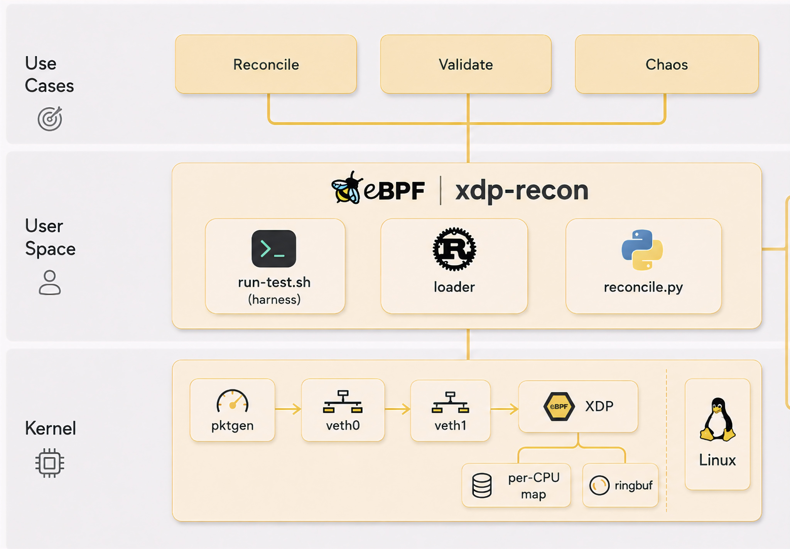

# xdp-recon



XDP packet drop reconciliation test harness. Built around a veth pair.

Three counter sources are reconciled at the end of each run:

- pktgen authoritative TX count from `/proc/net/pktgen/veth0` (or veth0 TX
  delta from `ip -s link` when the generator is mausezahn)
- kernel link stats from `ip -s link show` on both legs
- per CPU BPF map populated by the XDP program on veth1 ingress

The XDP program also enforces a destination-port drop filter, populated
from userspace via env var. The reconciler verifies that the number of
dropped packets exactly matches what the filter is configured to drop.

## Stated conditions

- one veth pair in the default namespace, no host bridge
- generator is either kernel pktgen (UDP) or mausezahn (TCP)
- packet size 64, count 10000000 for the unrestricted run
- two run modes for pktgen: unrestricted and rate limited to 100 Kpps
- BPF runtime stats enabled via sysctl
- generic offloads (tx, rx, gso, gro, tso, lro) disabled on both legs
- IPv6, ARP, and multicast disabled on both legs

## Reconciliation

A run passes when all five conditions hold:

```
offered_packets    == veth0_tx_packets
veth0_tx_packets   == xdp_rx_total
xdp_pass_count + xdp_drop_count == xdp_rx_total
xdp_drop_count     == expected_drops
xdp_parse_errors   == 0
```

`veth1_rx_packets` is reported but not asserted equal to `xdp_rx_total`.
veth driver behavior with `XDP_DROP` differs between generic and native
attach paths: in generic mode the RX counter increments before XDP runs,
in native mode it does not. The conditions above hold regardless.

`ringbuf_lost_events` is reported but does not affect pass or fail.

## Three runs, three verdicts

The three `reference-*/` directories in this repo are committed Lima
reference runs; the commands below write your own runs to fresh
`evidence-*/` directories alongside them. Reference data stays
untouched.


### Unrestricted

```
sudo PKT_COUNT=10000000 EVIDENCE=evidence-unrestricted ./run-test.sh
```

pktgen sends 10M UDP packets to port 5000. No filter, no chaos. Every
packet reaches XDP, nothing is dropped, every condition PASSes.

### Filter active

```
sudo PKT_COUNT=1000000 GENERATOR=mausezahn FILTER_DPORTS=5000 EVIDENCE=evidence-filter-active ./run-test.sh
```

mausezahn sends 1M TCP packets to port 5000. The XDP program looks up
port 5000 in `drop_ports` and returns `XDP_DROP` on every match.
`xdp_drop_count` lands at exactly 1M, `xdp_pass_count` at 0, and the
reconciler PASSes because that matches `expected_drops`.

### Chaos

```
sudo PKT_COUNT=1000000 CHAOS_LOSS_PCT=1 EVIDENCE=evidence-chaos ./run-test.sh
```

pktgen runs in `queue_xmit` mode (so the qdisc is honored). `netem`
drops 1% on veth0 egress. `offered_packets != veth0_tx_packets` and the
reconciler FAILs as expected. The harness exits 0 on this expected
FAIL. A chaos run that PASSes is a harness bug.

## Stack

- BPF program: C, compiled with clang
- Userspace loader: Rust, libbpf-rs plus libbpf-cargo
- Generators: kernel pktgen (UDP) and mausezahn (TCP)
- Reconciliation: scripts/reconcile.py

## Build

Linux host required. macOS users see the Lima section below.

```
sudo apt-get install -y \
  clang llvm libbpf-dev libelf-dev zlib1g-dev pkg-config build-essential \
  linux-tools-common linux-tools-generic ethtool iproute2 python3 \
  netsniff-ng
cargo build --release
```

`build.rs` invokes the libbpf-cargo skeleton builder. The BPF program
uses kernel uapi headers. On Debian and Ubuntu the multiarch include
path under `/usr/include/<triple>` is added automatically via
`dpkg-architecture`. No vmlinux.h required.

## Run

Build first as your normal user, then invoke the harness with sudo.
The harness intentionally does not run `cargo build` itself because
sudo does not inherit rustup state.

```
cargo build --release
sudo ./run-test.sh
```

The script clears `evidence/` at start. On any step failure it exits
non zero and leaves whatever evidence was already captured in place.

All knobs are env vars. No CLI flags. No config file.

| Var | Read by | Default | Effect |
|---|---|---|---|
| `PKT_COUNT` | run-test.sh | 10000000 | packets per run |
| `PKT_SIZE` | run-test.sh | 64 | byte size |
| `RATE_PPS` | run-test.sh | 0 | 0 means unrestricted; pktgen only |
| `MIN_DURATION` | run-test.sh | 60 | warning emitted if run finishes faster |
| `EVIDENCE` | run-test.sh | evidence | output directory |
| `GENERATOR` | run-test.sh | pktgen | pktgen (UDP) or mausezahn (TCP) |
| `FILTER_DPORTS` | run-test.sh | (none) | comma-separated TCP dports to drop at XDP |
| `TCP_DPORT` | run-test.sh | 5000 | mausezahn destination port |
| `CHAOS_LOSS_PCT` | run-test.sh | 0 | inject netem loss on veth0 to validate the reconciler |
| `XDP_RECON_IFACE` | loader | required | interface for XDP attach |
| `XDP_RECON_OUT` | loader | stdout | path for the JSON counter dump |
| `XDP_RECON_DROP_PORTS` | loader | (none) | comma-separated TCP dports to drop |

## results.md

Two sections. First is a fixed width counter table. Second is each pass
condition with PASS or FAIL, then the overall verdict, then
`mean_runtime_ns`, then `ringbuf_lost_events`. No prose. Screenshot
target.

## Lima quickstart

For macOS hosts.

```
limactl create --name=xdp --tty=false
limactl start xdp
limactl shell xdp -- sudo apt-get update
limactl shell xdp -- sudo apt-get install -y \
  clang llvm libbpf-dev libelf-dev zlib1g-dev pkg-config build-essential \
  linux-tools-common linux-tools-generic ethtool iproute2 python3 netsniff-ng
limactl shell xdp
cd ~/xdp-recon
cargo build --release
sudo ./run-test.sh
```

Lima default Ubuntu ships kernel 6.14. BPF, ringbuf, XDP, and pktgen
are all built in. Default instance is 4GB RAM and 4 CPUs.

The default `/Users/<user>` mount inside Lima is read only. Clone the
repo to a writable path inside the VM (for example `/tmp/work/xdp-recon`
or `~`) before building. Building from the read-only mount on the host
side will fail at the first `cargo` write.

## Design notes

- The BPF filter is a `BPF_MAP_TYPE_ARRAY` with 65536 entries, key
  `__u32`, value `__u8`. Array maps are preallocated and zero-init;
  the kernel rounds value slots to 8-byte alignment, so the actual
  memory footprint is on the order of 512 KiB plus metadata.
- Filtering happens only after a successful TCP parse. UDP and non-IP
  traffic flow through untouched.
- All counters live in a `BPF_MAP_TYPE_PERCPU_ARRAY` and are summed in
  userspace at shutdown. Per-CPU semantics avoid the cross-core
  read-modify-write race that a shared array map would introduce under
  load.
- `ringbuf_lost_events` is derived as `events_submitted - events_received`.
  `BPF_MAP_TYPE_RINGBUF` has no kernel side lost sample callback (unlike
  perfbuf). BPF side reserve failures are tracked separately in
  `events_failed`.
- The IPv4 header check enforces `ihl == 5`. That gives the verifier a
  constant offset to the TCP header. pktgen does not emit IP options;
  mausezahn defaults are the same here.
- pktgen has no native TCP synthesis mode in mainline. The filter demo
  uses mausezahn for that reason. pktgen's `flag TCP` is silently
  parsed but does not change the synthesized protocol.
